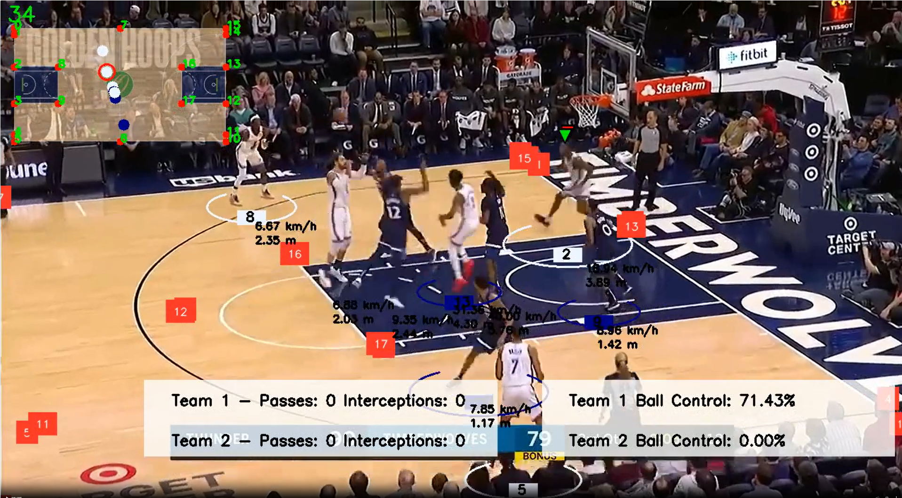
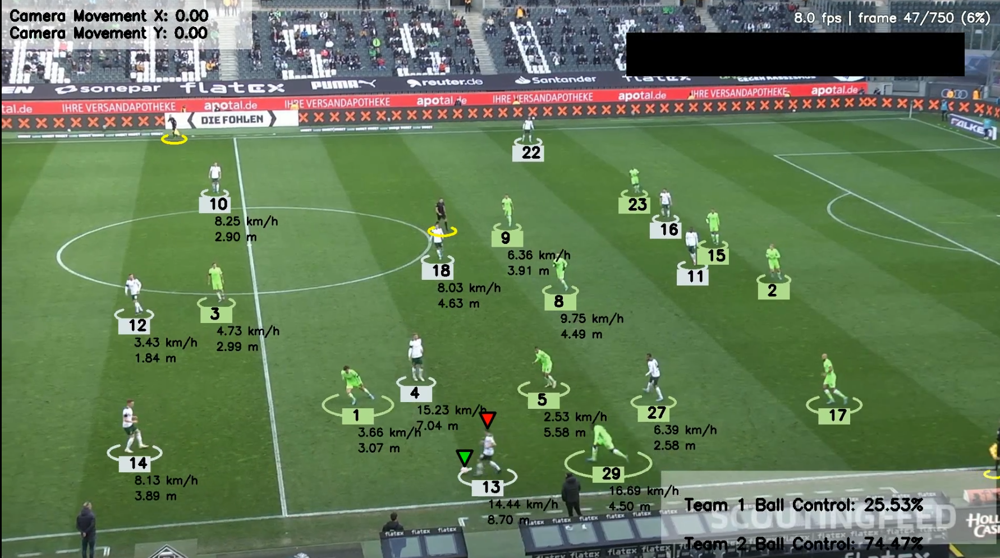
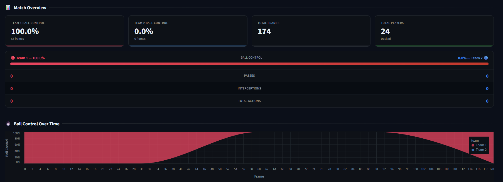
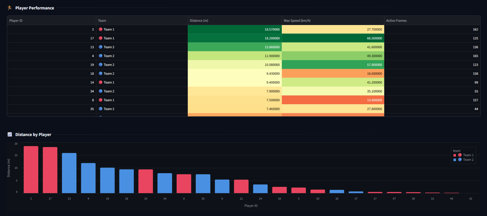
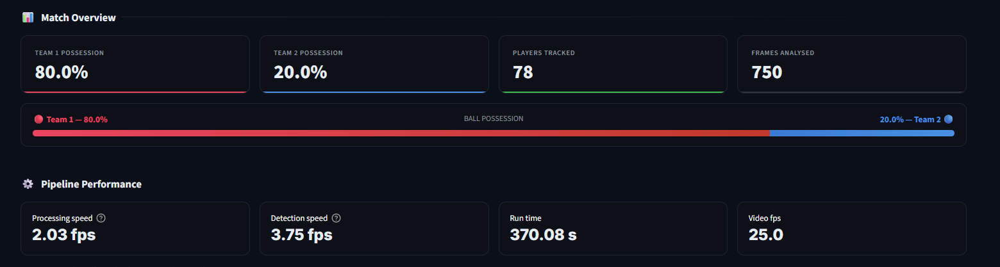
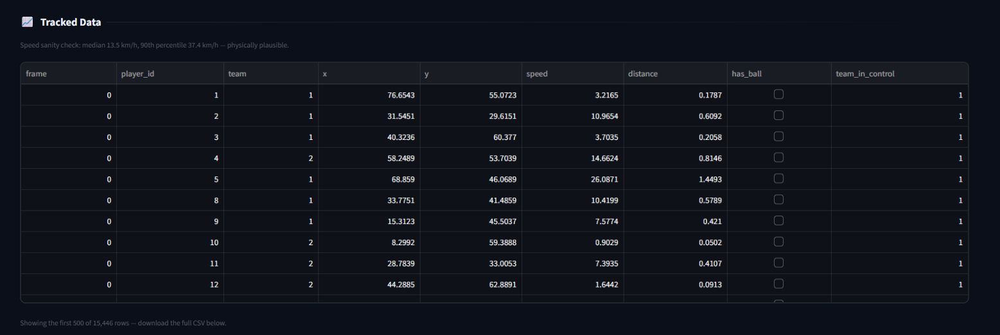

# 🏅 Sports Analysis

Two computer-vision match-analysis pipelines — **Basketball** and **Football** —
behind one Streamlit app with a sport switcher.

```
streamlit run app.py
```

| 🏀 Basketball | ⚽ Football |
| --- | --- |
|  |  |
| Player + ball tracking, team detection, court key-points, tactical view, speed & distance, passes and interceptions | Player + ball tracking, jersey-colour teams, possession, camera-movement compensation, speed & distance, heatmaps |

More output below: [basketball](#basketball-output) · [football](#football-output)

---

## Layout

```
sports_analysis/
├── app.py                    ← unified entry point (the router)
├── requirements.txt          ← merged dependencies for both sports
├── packages.txt              ← apt packages for Streamlit Cloud deploys
│
├── sports_core/              ← shared infrastructure
│   ├── registry.py           ← the list of sports + their metadata
│   ├── isolation.py          ← keeps the two package trees from colliding
│   └── theme.py              ← one dark design system, re-skinned per sport
│
├── basketball_analysis/      ← unchanged pipeline + ui.py page module
│   ├── ui.py                 ← render(sport) — the page
│   ├── app.py                ← standalone entry point (optional)
│   ├── trackers/  utils/  team_assigner/  drawers/  …
│   └── main.py               ← original CLI, untouched
│
└── football_analysis/        ← unchanged pipeline + ui.py page module
    ├── ui.py                 ← render(sport) — the page
    ├── app.py                ← standalone entry point (optional)
    ├── trackers/  utils/  team_assigner/  view_transformer/  …
    └── main.py               ← original CLI, untouched
```

Each sport's project folder is **self-contained and unmodified** — its
pipeline packages, models, stubs and `main.py` CLI all work exactly as before.
The only new file inside each is `ui.py`.

---

## Running

| Command | What you get |
| --- | --- |
| `streamlit run app.py` | Both sports — switch with the buttons at the top of the page |
| `streamlit run app.py` then `?sport=football` | Deep-link straight to a sport (optional; the buttons do the same) |
| `streamlit run basketball_analysis/app.py` | Basketball only |
| `streamlit run football_analysis/app.py` | Football only |
| `python basketball_analysis/main.py <video>` | Basketball CLI (unchanged) |
| `python football_analysis/main.py --input <video> --output <out>` | Football CLI (unchanged) |

### Install

```bash
python -m venv .venv
.venv\Scripts\activate          # Windows
# source .venv/bin/activate     # macOS / Linux

pip install -r requirements.txt
```

`ffmpeg` on your PATH is optional but recommended — both sports use it to
re-encode output to browser-playable H.264. (`packages.txt` installs it on
Streamlit Cloud.)

Optional Intel GPU acceleration, worth it only on a machine with an Intel iGPU:

```bash
pip install -r requirements-openvino.txt
```

---

## Deploying

`requirements.txt` is verified to resolve on **Python 3.12, 3.13 and 3.14**
(with `uv`, the resolver Streamlit Cloud uses), and both sport pages render
without errors when the model weights are absent — the real cold-start state,
since `models/` is gitignored.

**The host picks the Python version, not you.** A first deploy attempt failed
because Streamlit Cloud built on Python 3.14 — `.python-version` is *not* read
by that platform (you can select the version under *Advanced settings*, but the
requirements must survive whatever gets chosen). The failure cascaded:

1. `supervision==0.25.1` carries `numpy>=2.1.0 ; python_version >= "3.13"`,
   which contradicted a flat `numpy<2.0` pin → resolution failed outright.
2. pip then fell back and tried to build `numpy 1.26.4` from source, because
   numpy 1.x publishes no cp313/cp314 wheels. That is what made the build hang
   for ~45 minutes before dying.

So the numpy/torch pair is now chosen by marker rather than assumed:

```
numpy>=1.26,<2.0 ; python_version < "3.13"     torch==2.2.0 ; python_version < "3.13"
numpy>=2.1       ; python_version >= "3.13"    torch>=2.9   ; python_version >= "3.13"
```

Python ≤3.12 keeps the exact pairing that runs locally (torch 2.2.0 is built
against the NumPy 1.x C API, so it *must* have numpy<2). Python 3.13+ gets the
numpy-2 stack with a torch new enough to match.

Everything else moved from exact pins to **bounded ranges**. The exact pins had
no wheels on newer interpreters, and removing the bounds entirely is worse — an
unbounded resolve jumps to pandas 3, transformers 5 and OpenCV 5, which resolve
happily and then break at runtime. Every version inside the current ranges has
a cp314-installable wheel (exact, `abi3`, or universal), so the bounds cost
nothing.

Resolved versions per interpreter:

| | py3.12 | py3.13 | py3.14 |
| --- | --- | --- | --- |
| numpy | 1.26.4 | 2.5.3 | 2.5.3 |
| torch | 2.2.0 | 2.14.0 | 2.14.0 |
| pandas | 2.3.3 | 2.3.3 | 2.3.3 |
| opencv-headless | 4.11 | 4.14 | 4.14 |
| transformers | 4.57.6 | 4.57.6 | 4.57.6 |

Two more deliberate choices:

* **`roboflow` was dropped.** It is imported only by the training notebooks,
  never by the app — `pip install roboflow` if you go back to training.
* **OpenVINO is not in `requirements.txt`.** Cloud hosts have no Intel iGPU,
  and OpenVINO on plain CPU measured *slower* than PyTorch, so it would be pure
  build-time cost. The app hides the option when the package is missing.

### Model weights on a deploy

`models/` is gitignored, so **no weights reach the deployed app**. The two
sports now handle that the same way:

| Sport | Where weights come from |
| --- | --- |
| Basketball | Public Google Drive folder (3 checkpoints, ~745 MB), fetched on first use and cached |
| Football | Public Google Drive file (`best.pt`, 107 MB), fetched on first use and cached |

Football previously had *no* fetch mechanism at all — it just expected
`football_analysis/models/best.pt` to exist, which is why the deployed app
showed its detector as missing while basketball's were ready. Both now download
on demand, so **a fresh deploy needs no configuration**.

Resolution order for football, first hit wins:

1. `football_analysis/models/best.pt` on disk
2. a previous download in the cache (outside the repo, survives redeploys)
3. `football_model_url` in Streamlit secrets, or `FOOTBALL_MODEL_URL` in the
   environment
4. the built-in Drive link in `football_analysis/ui.py`

To point it at different weights without touching code, add to
**Settings → Secrets**:

```toml
football_model_url = "https://drive.google.com/file/d/<id>/view?usp=sharing"
```

A Drive folder link, a Drive file link, or any direct `.pt` URL all work. If a
fetch fails the sidebar shows the actual reason and offers a field to paste an
alternative, rather than a bare red chip.

One gotcha worth recording: `gdown` removed the `fuzzy=True` argument in
version 6, and `requirements.txt` allows both 5.x and 6.x. `weights.py`
therefore extracts the Drive file id itself and passes `id=`, which every
version accepts.

Two limits worth knowing before you deploy the basketball page:

* The three weight files total **745 MB** and are fetched from Google Drive on
  first use. On a 1 GB-RAM free tier that is likely to exhaust memory. The page
  degrades honestly if it fails — the models chip turns red and **Run Analysis**
  stays disabled — but it will not analyse anything. Smaller weights (or a
  paid tier) are the real fix.
* Analysis is CPU-bound there, at roughly the rates in the table below. Cap
  **Analyse first N seconds** before running anything on a hosted instance.

Football is lighter: one model, and it reads the path from the sidebar.

---

## How the two projects coexist

This is the one genuinely tricky part, so it's worth spelling out.

Both projects independently define **top-level packages with the same names**:

| Package | basketball | football |
| --- | :---: | :---: |
| `utils` | ✅ | ✅ |
| `trackers` | ✅ | ✅ |
| `team_assigner` | ✅ | ✅ |

In one Python process, whichever imports first wins `sys.modules` — so a naive
merge would silently feed football's `Tracker` to the basketball pipeline.
Renaming the packages would mean rewriting every import in both codebases.

Instead, `sports_core/isolation.py` sandboxes them. Streamlit re-runs the whole
script on every interaction, which gives a clean hook. Before rendering a sport,
`activate()`:

1. **evicts** every cached module whose file lives under a *different* sport's
   folder, and
2. **rewrites `sys.path`** so only the active sport's folder is importable.

Site-packages (torch, ultralytics, cv2, …) live outside the sport folders and
are never touched, so switching sports costs milliseconds rather than a reload.
Each sport's `ui.py` is then imported *by file path* under a unique module name
(`_sports_ui_basketball`), so the page modules can't collide either.

```python
isolation.activate(sport, ALL_ROOTS)   # sandbox
page = isolation.load_ui(sport)        # import ui.py by path
page.render(sport)                     # draw
```

---

## Performance notes (basketball, CPU)

Measured on a 2-core i3-1115G4, 720p footage, `imgsz=640`:

| Model | Params | CPU cost |
| --- | ---: | ---: |
| `player_detector.pt` | 86 M | ~0.9 s/frame |
| `ball_detector_model.pt` | 86 M | ~1.0 s/frame |
| `court_keypoint_detector.pt` | 70 M | ~1.7–2.3 s/frame |

That is **~3.6 s of compute per frame**, so a 10-second 30 fps clip is about
**18 minutes** of detection if every model runs on every frame. Model loading
is ~1 s and the Google Drive fetch happens once and is cached — neither is the
bottleneck. The cost is three large YOLO models on a CPU.

The **Performance** panel in the sidebar exposes the levers:

| Lever | Default | Effect |
| --- | --- | --- |
| Court key-points every Nth frame | **30** | ~2x overall. The court is static, so this is nearly free accuracy-wise — the single best setting. |
| Analyse first N seconds | off | Linear. The quickest way to get *a* result out of a long clip. |
| Detect every Nth frame | **1** (off) | ~Nx faster, but ByteTrack splits players into more IDs (13 → 18 on a 117-frame clip at stride 3), which skews per-player distance. Opt in for a quick look, not for final numbers. |
| Detection resolution | 640 | Quadratic. 416 is ~2.4x faster but misses the ball more often. |

Detections are cached per *(video content, settings)* under `stubs/<hash>_s…/`,
so re-running the same clip is instant. The cache used to be keyed by filename
alone, which meant a different video with the same frame count would silently
reuse the previous video's tracks.

### Inference backends (OpenVINO)

There is no NVIDIA GPU here, but the **Intel iGPU** can run the models via an
OpenVINO export of the same weights. Pick it under **Performance → Inference
backend**; the first run per resolution converts the models (~50 s total) and
caches the result, after which it is instant.

Per-model, 720p at `imgsz=640`:

| model | task | PyTorch CPU | OpenVINO iGPU | speedup |
| --- | --- | ---: | ---: | ---: |
| `player_detector` (YOLOv5l6u, 86 M) | detect | 1.11 s/f | 0.23 s/f | **4.9x** |
| `ball_detector_model` (YOLOv5l6u, 86 M) | detect | 1.16 s/f | 0.21 s/f | **5.6x** |
| `court_keypoint_detector` (YOLOv8x-pose, 70 M) | pose | 2.37 s/f | 0.37 s/f | **6.3x** |

End-to-end on a 117-frame clip (court key-points every 30th frame), detection
went from **343 s → 118 s, a 2.9x speedup**, with possession and ball-possession
frame counts identical and total distance within 2.8% (94.1 m → 91.5 m).

Two things worth knowing, both measured rather than assumed:

* **OpenVINO on the CPU is *slower* than PyTorch here** (~0.5x). The win is
  entirely from the iGPU, so CPU OpenVINO is offered but never the default.
* Exports use a **static batch of 1** — dynamic-shape exports were ~4x slower
  on the iGPU (0.88 vs 0.20 s/frame). The detector classes therefore take a
  `batch_size`, which `accel.batch_size_for()` sets to 1 for OpenVINO.

The exported model's **task must be passed explicitly** when loading
(`YOLO(dir, task="pose")`). Ultralytics cannot infer it from an OpenVINO
directory and silently assumes `detect`, which turns the court key-point model
into nonsense. `accel.model_task()` reads it from the original `.pt`.

Accuracy caveat: the ball detector finds slightly fewer low-confidence boxes
through OpenVINO (39 vs 44 over 8 frames). This was **identical at FP32 and
FP16**, so it is a decode/NMS difference, not a precision loss.

### Football

The football page has the same **Performance** panel — backend, max frames,
detect stride, detection resolution, output scale. Its detector
(`best.pt`, YOLOv5l, 53 M params) already ran one frame at a time, which is
exactly what a static batch-1 OpenVINO export wants.

Measured on 40 frames of `08fd33_4.mp4`:

| backend | total | processing | detection |
| --- | ---: | ---: | ---: |
| PyTorch CPU | 127 s | 0.32 fps | 0.34 fps |
| OpenVINO iGPU | **61 s** | **0.66 fps** | **0.77 fps** |

**2.1x end-to-end, 2.26x on detection.** The gap is smaller than basketball's
because football also runs optical-flow camera-movement estimation and
annotation per frame, and those stay on the CPU.

Team numbering may swap between runs (Team 1 ↔ Team 2). That is the KMeans
jersey clustering picking its cluster order, not a backend difference — the
possession split itself was 70/30 both times.

---

## Automatic pitch calibration (football)

Speed and distance need the four pitch corners, so image pixels can be mapped
to metres. **Automatic** is now the default and finds them without typing
coordinates ([football_analysis/pitch_calibration.py](football_analysis/pitch_calibration.py)):

1. Segment the grass, learning the turf hue *from the frame* rather than using
   a fixed green range — a hard-coded range fails under floodlights and on
   colour-graded broadcast feeds.
2. Take the largest grass component, close the holes players and lines punch in
   it, and reduce the convex hull to a quadrilateral.
3. Where the painted lines are visible, refine by intersecting the outermost
   near-horizontal and near-vertical lines — lines are a sharper boundary than
   the grass edge, which bleeds into the crowd.
4. Sample five frames across the clip and keep the most confident result, so a
   replay or a close-up cannot ruin it.

### It does not work for all cases, and here is exactly why

Two different things are needed, and only one is recoverable from video:

* **The shape** (where the corners are) — solved reliably.
* **The scale** (what those corners span in metres) — *not* solvable from one
  frame. The identical trapezoid could be a full pitch or one half of it, and
  **speed and distance scale linearly with that number**.

On the bundled clip the camera is zoomed in, so three of the four corners run
off the frame — the pitch continues out of shot. The detector reports this
honestly instead of hiding it:

| | zoomed-in clip | same pitch, fully in shot |
| --- | --- | --- |
| corners found | yes | yes |
| corners actually in shot | **1 of 4** | 4 of 4 |
| confidence | **25–35%** | **99%** |
| span note | `region-clipped` | `assumed-full-pitch` |

The confidence score is deliberately penalised per off-frame corner. Without
that term a zoomed view scored 99% while describing a region whose size is
unknowable — confident and wrong is worse than uncertain.

So: **Automatic removes the pixel-typing, not the judgement.** When corners are
clipped the UI says so, keeps 105 × 68 m only as a labelled default, and asks
you to enter the span you can actually see. Switching to **Manual corners**
starts pre-filled with the automatic result, so it is a starting point rather
than a rewrite.

### Speed sanity check

After a run the results panel compares the 90th-percentile speed against a
human ceiling (~37 km/h; the check trips at 45). It uses p90 rather than the
max because the extreme tail is dominated by ByteTrack identity switches, which
teleport a player and register as a huge instantaneous speed — blaming
calibration for that would be wrong, so the warning names both causes.

On the bundled clip: median 11 km/h, p90 38 km/h — plausible, no warning. The
*max* was 96 km/h, which is exactly the tracking-noise tail the check is built
to ignore.

### Fixed along the way

`--scale` resized every frame but left the calibration vertices alone, so
`--scale 0.5` silently halved every distance and speed. The vertices now scale
with the frames. Verified: max speed 95.6 km/h at scale 1.0 vs 109.1 at scale
0.5 — a 1.14x ratio rather than the 2x it was before.

---

## Adding a third sport

1. Drop the project folder in next to the others.
2. Add a `ui.py` to it exposing `render(sport)`.
3. Append one `Sport(...)` entry to `sports_core/registry.py`.

Nothing else changes — the switcher, theming and isolation pick it up
automatically.

---

## What each sport does

### 🏀 Basketball
Runs **in-process**. YOLO player + ball detection with ByteTrack, Fashion-CLIP
(or automatic colour-clustering) team assignment, court-keypoint homography to
a top-down tactical view, per-player speed & distance, pass/interception
detection, plus a frame explorer and CSV/JSON export.

Model weights are fetched automatically from Google Drive on first run and
cached; local `models/*.pt` files take priority if present.

#### Basketball output

**Annotated video.** Team-coloured ellipses under each player with their track
ID, live speed (km/h) and distance (m); the ball-carrier marked by a triangle;
detected court key-points in red; and the tactical top-down court inset, where
every player is projected through the court homography. The strip along the
bottom carries running ball-control, passes and interceptions per team.


**Match Overview.** Ball control per team with the frames each is based on,
total frames and unique players tracked, then the control bar with passes,
interceptions and total actions — and ball control plotted across the clip.



**Player Performance.** Per-player distance and top speed, colour-graded so
outliers stand out, ranked by distance covered.



### ⚽ Football
Runs the pipeline as a **subprocess** (`main.py`), streaming its logs live into
the page. YOLO + ByteTrack tracking, KMeans jersey-colour team assignment,
nearest-player ball possession, optical-flow camera-movement compensation,
perspective transform from four pitch corners, speed & distance, optional
per-player heatmaps, and per-frame CSV export.

Point the **Detection** panel at your trained weights (defaults to
`football_analysis/models/best.pt`).

#### Football output

**Annotated video.** Ellipses coloured by the KMeans jersey clustering — two
outfield teams plus yellow for the referee — each with its track ID, speed
(km/h) and distance (m). Triangles mark the ball and its current carrier. The
optical-flow camera-movement estimate is printed top-left, the live throughput
HUD top-right, and running possession bottom-right.


**Match Overview.** Possession split, players tracked and frames analysed,
followed by the pipeline's own throughput — useful for sizing a longer run
before you start it.



**Tracked data.** One row per player per frame — real-world x/y in metres,
speed, cumulative distance, ball possession and which team is in control. The
full table exports as CSV.

Note the line above the table: that is the [speed sanity check](#speed-sanity-check)
reporting *median 13.5 km/h, 90th percentile 37.4 km/h — physically plausible*.
It is the one automatic guard on calibration quality, since the metres-per-pixel
scale is the part the detector cannot measure for itself.




